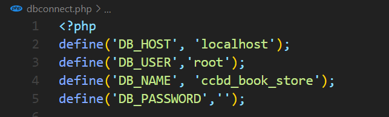

# BookStore:

A responsive website that displays available books in the store, along with their details.Website provides options such as browsing books based on categories or authors, searching the required book, viewing full description page of any book. It is also possible to sort the listing based on price or discount. User can register and login on subsequent accesses, view his/her cart, buy desired books. In case of any problem user can ask query which is directly sent as a mail to admin.

##Setup:

- Install Xampp if not already installed. You Can See This Video - https://youtube.com/watch?v=g1rG09QmiVo&feature=shares
- or Install Laragon if not already installed. You Can See This Video - https://youtube.com/watch?v=Qm5774whKMI&feature=shares
- Place the repository in htdocs / www folder of xampp / Laragon
- Go to Xampp / Laragon control panel and start apache and MySQL.
- Import the database ccbd_book_store.sql in MySql server.
- Set up the connection credentials in dbconnect.php   &nbsp;&nbsp;&nbsp;&nbsp;&nbsp;<kbd></kbd>
- Thats it. Open <a href="http://localhost/">localhost/"Your Folder Name"/</a> in your browser

###Website Link : <a href="https://developerrony.com">Click This Link</a>

## Preview
